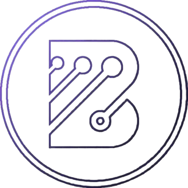

# 🚀 Brenno Santos | Portfólio de Desenvolvedor Fullstack

Bem-vindo ao repositório do meu portfólio pessoal! Este projeto foi construído para apresentar minha trajetória profissional, habilidades técnicas e projetos de uma forma moderna, interativa e de alta performance.

---

<div align="center">
  <a href="https://brennosantos.vercel.app">
    
  </a>
  <p><em>"Especialista em criar interfaces modernas e fluidas, focadas na experiência do usuário."</em></p>
</div>

---

## 🛠️ Tecnologias Utilizadas

Este projeto utiliza as tecnologias mais recentes do mercado para proporcionar uma experiência rápida e acessível:


---

## ✨ Principais Funcionalidades

- **🌍 Internacionalização (i18n):** Suporte completo para múltiplos idiomas (Inglês e Português) utilizando `react-i18next`.
- **✨ Animações Fluídas:** Elementos interativos e animações de scroll alimentadas por `framer-motion`.
- **📱 Totalmente Responsivo:** Otimizado para todos os tamanhos de tela, de dispositivos móveis a desktops.
- **⚡ Performance:** Desenvolvido com **Vite** para hot reloading ultra-rápido e builds de produção otimizados.
- **🎨 UI/UX Moderna:** Estilizado com **Tailwind CSS** seguindo princípios modernos de design, como glassmorphism e efeitos de gradiente.
- **📜 Semântica & SEO:** Estruturado com tags HTML5 semânticas para melhor acessibilidade e ranqueamento em buscadores.

---

## 📂 Estrutura do Projeto

```bash
src/
├── assets/             # Currículo, imagens e arquivos JSON de tradução
├── components/         # Componentes React modulares (Navbar, Seções, etc.)
├── hooks/              # Hooks customizados (ex: animações de scroll)
├── types.d.ts          # Declarações globais de TypeScript
├── index.css           # Estilos globais e configuração do Tailwind
└── main.tsx            # Ponto de entrada da aplicação
```

---

## ✉️ Contato & Links

Estou sempre aberto a discutir novos projetos, ideias criativas ou oportunidades.

- **Website:** [brennosantos.vercel.app](https://brennosantos.vercel.app)
- **LinkedIn:** [linkedin.com/in/brenno-santos-57399b334](https://www.linkedin.com/in/brenno-santos-57399b334/)
- **Email:** [devblsds@gmail.com](mailto:devblsds@gmail.com)
- **Github:** [@devbls](https://github.com/devbls)

---

<p align="center">Feito com ❤️ por Brenno Santos</p>
